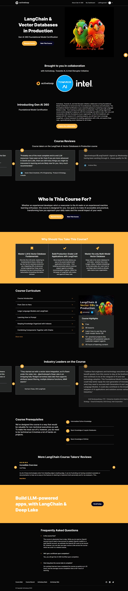

# LangChain & Vector Databases Learning Repository

This repository is dedicated to my learning journey through the [LangChain & Vector Databases in Production](https://learn.activeloop.ai/courses/langchain) course offered by ActiveLoop. The course is part of the Gen AI 360 Foundational Model Certification and focuses on mastering Large Language Models (LLMs) and Vector Databases.

## Course Overview

- **LangChain**: A robust framework for building applications with LLMs.
- **Vector Databases**: Understanding Deep Lake, a groundbreaking vector database for all AI data.
- **Projects**: 10+ practical projects to build real-world applications.
- **Duration**: 40+ hours of learning content.

## What's Inside This Repository

- **Projects**: Projects developed during the course.
- **Code Snippets**: Various code examples and exercises from the course.
- **Notes**: Personal notes and insights related to LangChain and Vector Databases.

## How to Use This Repository

Feel free to explore the code and projects.

### Course Modules

- Course Introduction
- From Zero to Hero
- Large Language Models and LangChain
- Learning How to Prompt
- Keeping Knowledge Organized with Indexes
- Combining Components Together with Chains
- Giving Memory to LLMs
- Making LLMs Interact with the World Using Tools
- Using Language Model as Reasoning Engines with Agents

## License

This project is licensed under the MIT License - see the [LICENSE.md](LICENSE.md) file for details.

## Acknowledgments

- Thanks to ActiveLoop for providing this comprehensive course.
- Special shout out to the community and fellow learners for the support and collaboration.

---

Feel free to connect with me on [LinkedIn](https://www.linkedin.com/in/john-leskas/) or follow me on [GitHub](https://github.com/jin0c).

Happy Learning!

